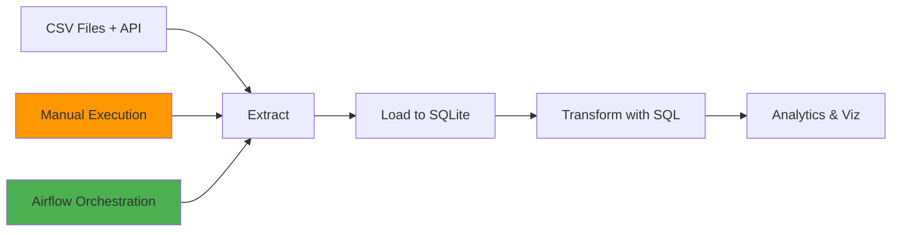

# 🛒 E-Commerce Data Pipeline Project

> **Complete ELT (Extract, Load, Transform) pipeline with automated orchestration using Apache Airflow**

This project implements a comprehensive data pipeline for analyzing Brazilian e-commerce data from Olist. It includes both **manual execution** and **automated orchestration** approaches, demonstrating modern data engineering practices.

## 📊 Project Overview

### Business Problem
Analyze e-commerce data to understand:
- Revenue patterns by state and time
- Delivery performance vs estimates  
- Product category performance
- Customer behavior and geography

### Data Source
- **Primary**: Brazilian E-Commerce Public Dataset by Olist (9 CSV files)
- **Secondary**: Brazil Public Holidays API
- **Output**: SQLite database with transformed analytics tables

---

## 🏗️ Architecture Overview



### Two Execution Methods:

1. **🔧 Manual Pipeline** - Run steps individually for development/testing
2. **⚡ Automated Orchestration** - Scheduled, monitored, and reliable production pipeline

---

## 📊 Dataset Setup

**⚠️ The dataset files are not included in this repository due to size constraints (126MB+).**

**Download the Olist E-Commerce Dataset:**

1. **Visit**: [Olist Brazilian E-Commerce Public Dataset by André Sionek on Kaggle](https://www.kaggle.com/datasets/olistbr/brazilian-ecommerce)
2. **Download** all CSV files (sign in to Kaggle required)
3. **Create** a `dataset/` folder in the project root
4. **Place** all CSV files in the `dataset/` folder

**Required files:**
- `olist_customers_dataset.csv`
- `olist_geolocation_dataset.csv`  
- `olist_order_items_dataset.csv`
- `olist_order_payments_dataset.csv`
- `olist_order_reviews_dataset.csv`
- `olist_orders_dataset.csv`
- `olist_products_dataset.csv`
- `olist_sellers_dataset.csv`
- `product_category_name_translation.csv`

---

## 🚀 Quick Start Guide

### Prerequisites
- Python 3.8+
- Docker Desktop (for orchestration)
- Git
- **Dataset files** (see Dataset Setup above)

### Option 1: Automated Pipeline (Recommended)

**Start the complete automated pipeline in 2 commands:**

```bash
# 1. Navigate to airflow directory
cd airflow

# 2. Start Airflow with Docker
docker-compose -f docker-compose-simple.yml up -d
```

**Access the Web UI:**
- Open: http://localhost:8080
- Login: `admin` / `admin`
- Click `ecommerce_etl_pipeline` → "Trigger DAG"

### Option 2: Manual Pipeline

```bash
# 1. Install dependencies
pip install -r requirements.txt

# 2. Run pipeline steps manually
python -c "from src.extract import extract; extract()"
python -c "from src.load import load; load()"  
python -c "from src.transform import run_queries; run_queries()"

# 3. Open Jupyter notebook for analysis
jupyter notebook "AnyoneAI - Sprint Project 01.ipynb"
```

---

## 📁 Project Structure

```
├── 📂 airflow/                    # 🆕 AUTOMATED ORCHESTRATION
│   ├── dags/
│   │   ├── ecommerce_etl_dag.py   # Main automated pipeline
│   │   └── simple_ecommerce_dag.py # Demo pipeline
│   ├── operators/
│   │   └── etl_operators.py       # Custom Airflow operators
│   ├── docker-compose-simple.yml  # Docker setup
│   └── logs/                      # Execution logs
│
├── 📂 src/                        # 📋 CORE PIPELINE CODE
│   ├── extract.py                 # Data extraction logic
│   ├── load.py                    # Database loading logic
│   ├── transform.py               # SQL query execution
│   ├── config.py                  # Configuration settings
│   └── plots.py                   # Visualization functions
│
├── 📂 dataset/                    # 📊 RAW DATA
│   ├── olist_customers_dataset.csv
│   ├── olist_orders_dataset.csv
│   └── ... (9 CSV files total)
│
├── 📂 queries/                    # 🔍 SQL TRANSFORMATIONS
│   ├── revenue_by_month_year.sql
│   ├── top_10_revenue_categories.sql
│   └── ... (7 SQL files)
│
├── 📂 tests/                      # ✅ QUALITY ASSURANCE
│   ├── test_extract.py
│   ├── test_transform.py
│   └── query_results/
│
├── AnyoneAI - Sprint Project 01.ipynb  # 📈 ANALYSIS NOTEBOOK
├── olist.db                      # 💾 Generated SQLite database
└── requirements.txt               # 📦 Python dependencies
```

---

## 🔄 Pipeline Flow Detailed

### Phase 1: Extract 📥
**Source**: `src/extract.py`
- Reads 9 CSV files from `/dataset` folder
- Fetches Brazil public holidays from API for 2017
- Validates data quality and structure
- **Output**: Python DataFrames in memory

**Data Sources:**
- Customer demographics and locations
- Order details and timestamps  
- Product information and categories
- Payment and shipping data
- Customer reviews and ratings

### Phase 2: Load 📤
**Source**: `src/load.py`
- Creates SQLite database (`olist.db`)
- Loads all DataFrames into database tables
- Maintains referential integrity
- **Output**: Normalized database ready for analysis

**Database Tables:**
- `customers`, `orders`, `order_items`
- `products`, `sellers`, `payments`
- `reviews`, `geolocation`, `holidays`

### Phase 3: Transform 🔄
**Source**: `src/transform.py` + `queries/*.sql`
- Executes 7 analytical SQL queries
- Generates business intelligence tables
- Calculates metrics and KPIs
- **Output**: Analytics tables for visualization

**Analytics Generated:**
- Monthly/yearly revenue trends
- State-wise revenue distribution
- Top/bottom product categories
- Delivery performance analysis
- Customer satisfaction metrics

### Phase 4: Analyze & Visualize 📊
**Source**: Jupyter notebook
- Interactive data exploration
- Statistical analysis and insights
- Professional visualizations
- Business recommendations

---

## ⚡ Airflow Orchestration Features

### 🎯 What Makes It Production-Ready

**🕐 Scheduling**
- Runs automatically daily at 2:00 AM
- No manual intervention required
- Configurable schedule patterns

**🔄 Reliability**
- 2 automatic retries with 5-minute delays
- Task dependencies ensure correct execution order
- Failure notifications and error handling

**📊 Monitoring**
- Real-time web dashboard
- Task execution logs and metrics
- Performance tracking and alerting

**🔧 Maintenance**
- Version control for pipeline code
- Easy configuration management
- Rollback capabilities

### 🌐 Web Interface Features

Access http://localhost:8080 to:
- **📈 Dashboard**: Overview of all pipelines
- **🔍 DAG View**: Visual pipeline representation  
- **📋 Task Logs**: Detailed execution information
- **⚙️ Configuration**: Pipeline settings and schedules
- **📊 Metrics**: Performance and success rates

---

## 🛠️ Development & Testing

### Run Tests
```bash
# Test data extraction
pytest tests/test_extract.py

# Test data transformations  
pytest tests/test_transform.py

# Test all components
pytest tests/
```

### Manual Development Workflow
```bash
# 1. Modify source code in src/
# 2. Test individual components
python -m src.extract
python -m src.load  
python -m src.transform

# 3. Verify results in database
sqlite3 olist.db ".tables"
```

### Airflow Development
```bash
# Check DAG syntax
cd airflow
docker exec airflow_standalone python -m py_compile /opt/airflow/dags/ecommerce_etl_dag.py

# View DAG structure  
docker exec airflow_standalone airflow dags list

# Test individual tasks
docker exec airflow_standalone airflow tasks test ecommerce_etl_pipeline extract_data 2024-01-01
```

---

## 🐳 Docker Management

### Start Pipeline
```bash
cd airflow
docker-compose -f docker-compose-simple.yml up -d
```

### Monitor Logs
```bash
# View all logs
docker logs airflow_standalone

# Follow logs in real-time
docker logs airflow_standalone -f

# Check container status
docker-compose -f docker-compose-simple.yml ps
```

### Stop Pipeline
```bash
docker-compose -f docker-compose-simple.yml down
```

### Troubleshooting
```bash
# Restart containers
docker-compose -f docker-compose-simple.yml restart

# Clean restart (removes data)
docker-compose -f docker-compose-simple.yml down -v
docker-compose -f docker-compose-simple.yml up -d
```

---

## 📈 Key Insights & Analytics

This pipeline generates insights on:

### 💰 Revenue Analysis
- Monthly revenue trends (2016-2018)
- Top 10 revenue-generating states
- Product category performance
- Seasonal patterns and growth

### 🚚 Logistics Performance  
- Delivery time vs estimates by state
- Shipping performance metrics
- Geographic distribution analysis

### 🛍️ Product Intelligence
- Top/bottom performing categories
- Order volume and value correlation
- Product popularity trends

### 👥 Customer Behavior
- Geographic customer distribution
- Review patterns and satisfaction
- Purchase timing and preferences

---

## 🎯 Business Value

### For Data Engineers
- **Production-ready pipeline** with monitoring and scheduling
- **Modern best practices** using Docker and Airflow
- **Scalable architecture** that can handle larger datasets
- **Automated testing** and quality assurance

### for Business Analysts
- **Reliable daily updates** without manual intervention
- **Rich analytics dataset** ready for BI tools
- **Historical trend analysis** with consistent data quality
- **Self-service access** to pipeline status and logs

### For Data Scientists
- **Clean, validated datasets** for modeling
- **Reproducible data preparation** process
- **Feature engineering pipeline** ready for ML
- **A/B testing framework** for experiments

---

## 🚀 Next Steps & Extensions

### Possible Enhancements
- **🔄 Real-time streaming** with Apache Kafka
- **☁️ Cloud deployment** on AWS/GCP/Azure
- **📊 Advanced analytics** with machine learning
- **🔐 Security hardening** with authentication
- **📈 Performance optimization** for larger datasets
- **🔔 Alert systems** for business KPIs

### Production Considerations
- **Database scaling** to PostgreSQL/Snowflake
- **Data validation** with Great Expectations  
- **Monitoring** with Prometheus/Grafana
- **CI/CD pipeline** for code deployment
- **Data lineage** tracking and documentation

---

## 🎉 Achievement Summary

This project demonstrates:
- ✅ **Complete ELT pipeline** from raw data to insights
- ✅ **Production orchestration** with Apache Airflow
- ✅ **Modern containerization** with Docker
- ✅ **Automated scheduling** and monitoring
- ✅ **Quality assurance** with comprehensive testing
- ✅ **Business intelligence** with actionable insights

**From manual scripts to enterprise-grade automation - this is how modern data engineering works!** 🚀

---

## 📞 Support & Documentation

- **Pipeline Issues**: Check Airflow logs at http://localhost:8080
- **Data Questions**: Review SQL queries in `/queries` folder  
- **Development**: Follow testing procedures in `/tests`
- **Business Logic**: See analysis notebook for context

**Happy Data Engineering! 🎊**
